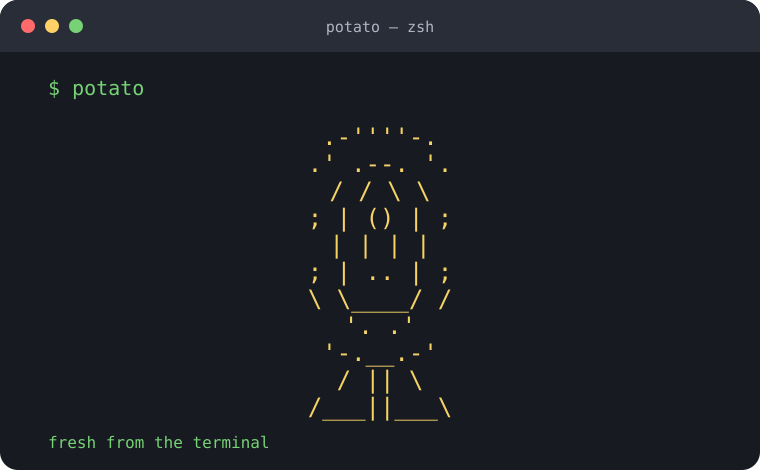

# Symmetrical Potato

A tiny Rust terminal command that draws a cheerful, perfectly symmetrical
potato. It is dependency-free, starts instantly, and uses a warm golden
palette when your terminal supports ANSI colors.



## Run it

```sh
cargo run
```

For plain ASCII output without terminal colors:

```sh
cargo run -- --plain
```

## Install locally

```sh
cargo install --path .
potato
```
